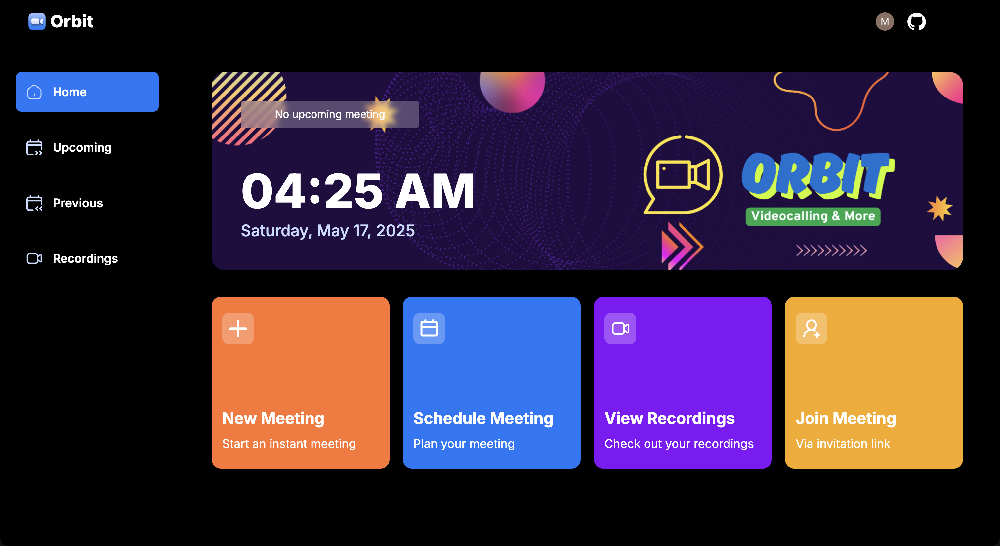

# Orbit - Videocalling and more

**Orbit** is a modern, feature-rich video calling application built with Next.js and powered by Stream’s real-time video and chat SDKs. It provides high-quality video calls, live audio, chat, screen sharing, and meeting scheduling in a beautiful, responsive interface.
  
## Screenshot


## Table of Contents

- [Orbit - Videocalling and more](#orbit---videocalling-and-more)
  - [Screenshot](#screenshot)
  - [Table of Contents](#table-of-contents)
  - [Features](#features)
  - [Tech Stack](#tech-stack)
  - [Demo](#demo)
  - [Getting Started](#getting-started)
    - [Prerequisites](#prerequisites)
    - [Installation](#installation)
    - [Environment Variables](#environment-variables)
    - [Running Locally](#running-locally)
  - [Project Structure](#project-structure)
  - [Contributing](#contributing)

## Features

- One-on-one and group video calls
- Live audio-only mode
- Real-time chat alongside video
- Screen sharing for presentations
- Meeting scheduling and upcoming recordings
- Responsive UI for desktop and mobile
- User authentication with Clerk
- Customizable toast notifications and dialogs

## Tech Stack

- **Framework**: Next.js 14 (App Router)
- **Language**: TypeScript
- **UI**: Tailwind CSS, Radix UI, shadcn-ui, Lucide icons
- **Auth**: Clerk for next-auth integration
- **Real-time**: @stream-io/video-react-sdk (video & chat)
- **Styling**: class-variance-authority, Tailwind CSS animations
- **Date Picker**: react-datepicker
- **Bundler**: Bun (optional) or npm/yarn

## Demo

A live demo will be available at: `https://orbit.buildwithmanish.com` (replace with your deployment URL)

## Getting Started

### Prerequisites

- Node.js (v18+)
- Bun (optional, highly recommended for fast installs) or npm/yarn
- A Clerk account with a published API key
- A Stream account with an API key and secret

### Installation

```bash
# Using Bun
git clone https://github.com/manish-9245/orbit.git
cd orbit
bun install

# Or using npm
git clone https://github.com/manish-9245/orbit.git
cd orbit
npm install
```

### Environment Variables

Create a `.env.local` file in the project root and provide the following:

```bash
NEXT_PUBLIC_CLERK_PUBLISHABLE_KEY=your-clerk-publishable-key
CLERK_SECRET_KEY=your-clerk-secret-key
STREAM_VIDEO_API_KEY=your-stream-video-api-key
STREAM_VIDEO_API_SECRET=your-stream-video-api-secret
NEXTAUTH_URL=http://localhost:3000
``` 

### Running Locally

```bash
# Development server
bun dev
# or
npm run dev
```

Navigate to `http://localhost:3000` in your browser to see the app.

## Project Structure

```
/app             # Next.js App Router entrypoints
  ├─ layout.tsx  # Root layout including ClerkProvider
  ├─ head.tsx    # SEO metadata and Open Graph tags
  └─ ...         # Pages and sub-folders
/components      # Reusable UI components and modals
/config          # Site-wide configuration (metadata, SEO)
/hooks           # Custom React hooks for data fetching
/lib             # Utility functions
/providers       # Context and SDK providers
/public          # Static assets (icons, images, favicon)
```

## Contributing

Contributions are welcome! Please follow these steps:

1. Fork the repository
2. Create a new branch: `git checkout -b feature/YourFeature`
3. Make your changes and commit them: `git commit -m "feat: add YourFeature"`
4. Push to the branch: `git push origin feature/YourFeature`
5. Open a Pull Request describing your changes